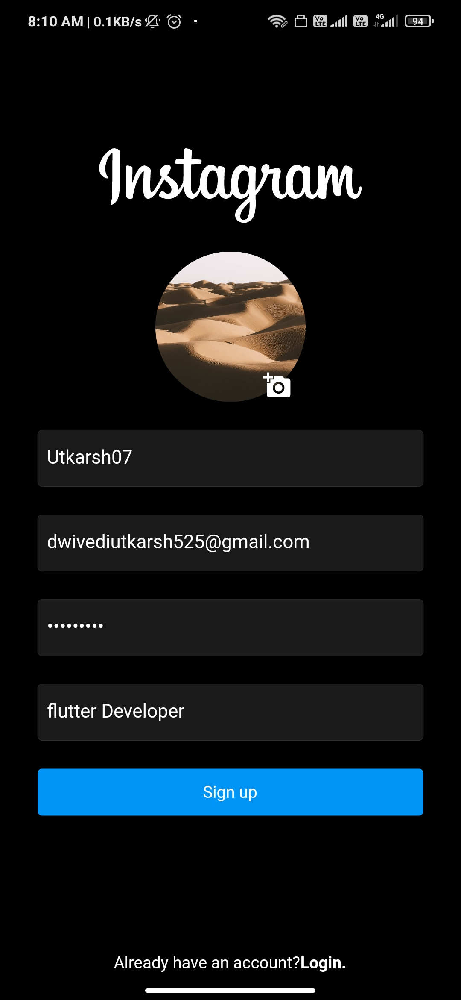
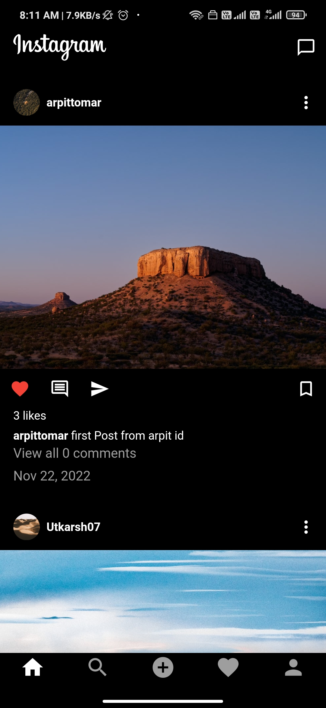
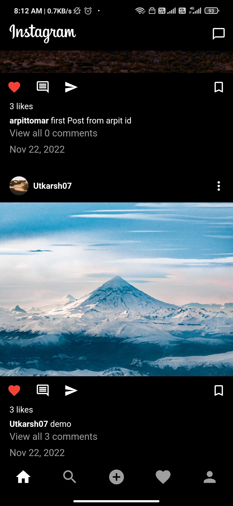
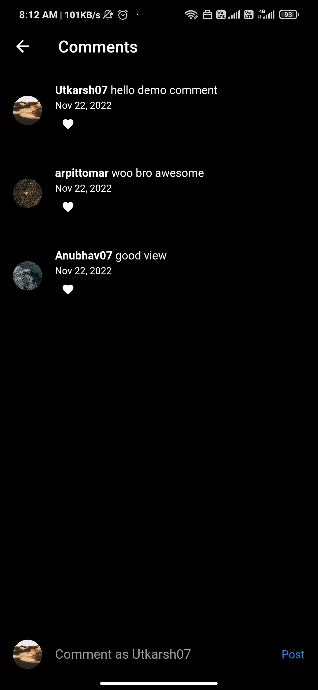
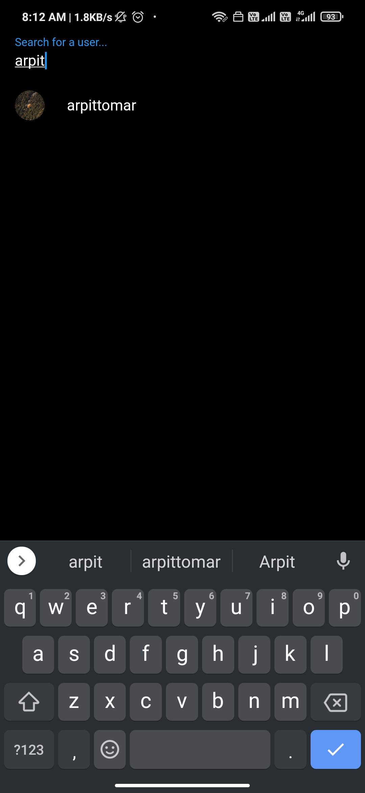
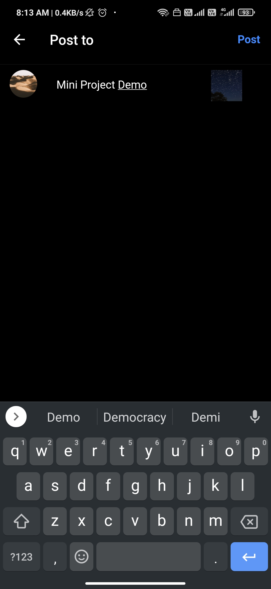
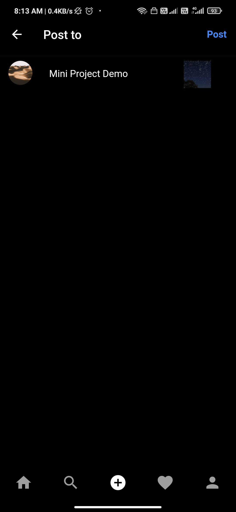
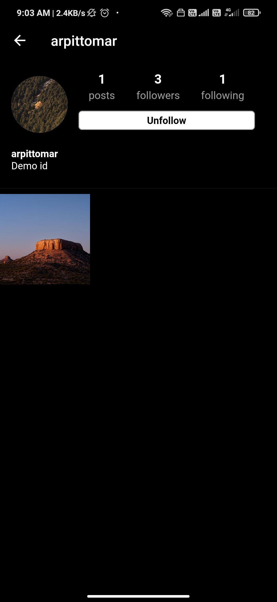

 <!--  -->

 

## Full Stack Instagram Clone
    
 

<!-- ## A new Flutter project. -->

 &nbsp; &nbsp; 

<!--   
 -->

<!-- ## Getting Started

This project is a starting point for a Flutter application.

A few resources to get you started if this is your first Flutter project:

- [Lab: Write your first Flutter app](https://docs.flutter.dev/get-started/codelab)
- [Cookbook: Useful Flutter samples](https://docs.flutter.dev/cookbook)

For help getting started with Flutter development, view the
[online documentation](https://docs.flutter.dev/), which offers tutorials,
samples, guidance on mobile development, and a full API reference. -->

  
# Introduction To Technologies Used 
 

###  1- Dart (Programming Language) :
- It is a platform-independent language and supports all operating systems.
- It is an open-source language, which means it available free for everyone.
- It is an object-oriented programming language and supports all features of oops.
- It is very useful in building real-time applications because of its stability.
- It consists of many useful inbuilt libraries.

### 2- Flutter (UI Toolkit) : 
- Flutter is a free and open-source framework for developing mobile applications.
- Apps made with flutter can be operated on both the platform (iOS and Android).
- This can be advantageous for the companies, as they require a smaller number of developers.
- Since small number of developers needed, the cost of development of the app also reduces.
- Hot Reload – Within a second the changes get updated.

### 3- Firebase (Database) :
- Firebase is a real-time database.
- It has massive storage size potential.
- Firebase is serverless.
- It is highly secure.
- We can easily access data, files, auth, and more.
- There is no server infrastructure required to power apps with data.
- It has JSON storage, which means no barrier between data and objects.

 

# Application UI
 &nbsp; &nbsp;  &nbsp; &nbsp;    &nbsp; &nbsp;   &nbsp; &nbsp; 
    &nbsp; &nbsp;   &nbsp; &nbsp;    &nbsp; &nbsp;     &nbsp; &nbsp;   &nbsp; &nbsp;    &nbsp; &nbsp; 
<!--     -->

 

# Contributors:

